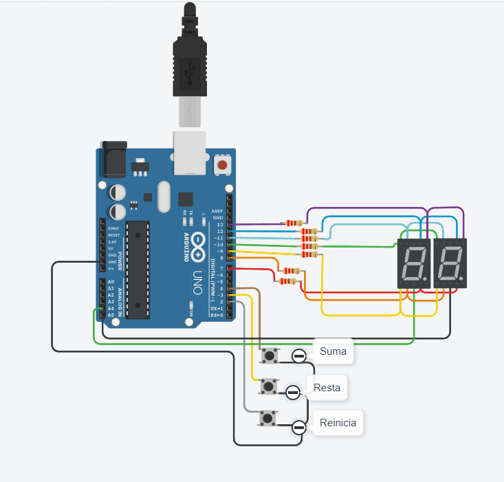

# Parcial grupal primera parte.

## Alumnos:
 
 * Alan Corimayo 
 * Emiliano Garcia
 * Jonathan Fernandez

## Proyecto: Contador de 0-99



### Descripción
Este proyecto cumple la función de un contador de 0-99
que se muestran mediante 2 display multiplexados cuenta con 3 botones los cuales suman o restan una unidad y uno adicional que reinicia el contadora a 0.

### Función principal
Asignación de pines y pulsadores:
```c++
// DEFINIMOS los pines para tomar los display y los pulsadores
#define A 12
#define B 13
#define C 7
#define D 8
#define E 9
#define F 11
#define G 10
#define pulsadorSumar 4
#define pulsadorRestar 3
#define btnReinicio 2
```
Declaración y inicialización de variables:
```c++
// inicializamos variables a utilizar dentro del código
int contadorNumeros = 0;

// inicializamos los lectores de pulsadores
// para poder lograr el antirrebote
int leerReiniciar = 0;
int leerSumar = 0;
int leerRestar = 0;
int restarAnterior = 1;
int sumarAnterior = 1;
int reiniciarAnterior = 1;
int estado_interuptor;
```
Entradas y salidas digitales:
```c++
void setup()
{
  pinMode(7, OUTPUT);
  pinMode(8, OUTPUT);
  pinMode(9, OUTPUT);
  pinMode(10, OUTPUT);
  pinMode(11, OUTPUT);
  pinMode(12, OUTPUT);
  pinMode(13, OUTPUT);
  pinMode(4, INPUT_PULLUP);
  pinMode(3, INPUT_PULLUP);
  pinMode(2, INPUT_PULLUP);
  pinMode(A4, OUTPUT);
  pinMode(A5, OUTPUT);
}
```
En el bucle se ejecutara el antirrebote para mejor uso de los pulsadores y al final llamamos a la función para el manejo de los display:
```c++
void loop()
{
  int presionoTecla = teclaPrecionada();
  if (presionoTecla == pulsadorSumar)
  {
    contadorNumeros++;

    if (contadorNumeros > 99)
    {
      contadorNumeros = 0;
    }
  }
  else if (presionoTecla == pulsadorRestar)
  {
    contadorNumeros--;
    if (contadorNumeros < 0)
    {
      contadorNumeros = 99;
    }
  }
  else if (presionoTecla == btnReinicio)
  {
    contadorNumeros = 0;
  }

  manejarDisplay(contadorNumeros);
}
```
Funcion para lograr el funcionamiento del multiplexado:

Los displays están en un sistema de multiplexado  Controlamos con esta función qué display se enciende en qué momento
de esta manera y con ayuda del delay logramos el efecto de que están 
encendidos ambos displays cuando en realidad se encienden y se apagan.


```c++
void manejarDisplay(int contadorNumeros)
{
  /*Esta función sirve para manejar los números y el encendido y apagado de displays, al contador lo dividimos por 10 para poder sacar los dígitos.*/  
  numerosDisplay(contadorNumeros / 10);
  prenderDisplay(1, 0);
  delay(50);
  // sacamos las decenas para mostrar en el primer display
  numerosDisplay(contadorNumeros - 10 * ((int)contadorNumeros / 10));
  prenderDisplay(0, 1);
  delay(50);
}
```
Esta función sirve para mostrar los números correspondientes:

```c++
void numerosDisplay(int numero)
{
  // y llamamos a la función borrarDisplay para el apagado de los dígitos
  borrarDisplay();

  switch (numero)
  {
  case 0:
    digitalWrite(A, 1);
    digitalWrite(B, 1);
    digitalWrite(C, 1);
    digitalWrite(D, 1);
    digitalWrite(E, 1);
    digitalWrite(F, 1);
    break;
  case 1:
    digitalWrite(B, 1);
    digitalWrite(C, 1);
    break;
  case 2:
    digitalWrite(A, 1);
    digitalWrite(B, 1);
    digitalWrite(G, 1);
    digitalWrite(E, 1);
    digitalWrite(D, 1);
    break;
  case 3:
    digitalWrite(A, 1);
    digitalWrite(B, 1);
    digitalWrite(G, 1);
    digitalWrite(C, 1);
    digitalWrite(D, 1);
    break;
  case 4:
    digitalWrite(F, 1);
    digitalWrite(B, 1);
    digitalWrite(G, 1);
    digitalWrite(C, 1);
    break;
  case 5:
    digitalWrite(A, 1);
    digitalWrite(F, 1);
    digitalWrite(G, 1);
    digitalWrite(C, 1);
    digitalWrite(D, 1);
    break;
  case 6:
    digitalWrite(A, 1);
    digitalWrite(F, 1);
    digitalWrite(G, 1);
    digitalWrite(C, 1);
    digitalWrite(E, 1);
    digitalWrite(D, 1);
    break;
  case 7:
    digitalWrite(A, 1);
    digitalWrite(B, 1);
    digitalWrite(C, 1);
    break;
  case 8:
    digitalWrite(A, 1);
    digitalWrite(B, 1);
    digitalWrite(C, 1);
    digitalWrite(D, 1);
    digitalWrite(E, 1);
    digitalWrite(F, 1);
    digitalWrite(G, 1);
    break;
  case 9:
    digitalWrite(A, 1);
    digitalWrite(B, 1);
    digitalWrite(C, 1);
    digitalWrite(F, 1);
    digitalWrite(G, 1);
    break;
  default:
    break;
  }
}
```
Funcion borrar display:
```c++
void borrarDisplay()
{
  digitalWrite(A, 0);
  digitalWrite(B, 0);
  digitalWrite(C, 0);
  digitalWrite(D, 0);
  digitalWrite(E, 0);
  digitalWrite(F, 0);
  digitalWrite(G, 0);
}
```
Función que maneja el ON de los display
para indicar qué display prender y en qué momento
```c++
void prenderDisplay(int display1, int display2)
{
  digitalWrite(A5, display1);
  digitalWrite(A4, display2);
}
```
Función para recrear el antirrebote
```c++
int teclaPrecionada(void)
{
  // primero obtenemos los pulsadores
  leerReiniciar = digitalRead(btnReinicio);
  leerSumar = digitalRead(pulsadorSumar);
  leerRestar = digitalRead(pulsadorRestar);

  // Si no están pulsados se inicializan en 1 y nos quedamos con ese estado
  if (leerSumar == 1)
  {
    sumarAnterior = 1;
  }

  if (leerRestar == 1)
  {
    restarAnterior = 1;
  }
  if (leerReiniciar == 1)
  {
    reiniciarAnterior = 1;
  }

  // preguntamos si fue pulsado y si el estado anterior es distinto
  // entonces modificamos y devolvemos el pulsador
  // de esta manera logramos el efecto antirrebote

  if (leerSumar == 0 && leerSumar != sumarAnterior)
  {
    sumarAnterior = leerSumar;
    return pulsadorSumar;
  }

  if (leerRestar == 0 && leerRestar != restarAnterior)
  {
    restarAnterior = leerRestar;
    return pulsadorRestar;
  }

  if (leerReiniciar == 0 && leerReiniciar != reiniciarAnterior)
  {
    reiniciarAnterior = leerReiniciar;
    return btnReinicio;
  }
  // si no pasa nada de lo anterior se devuelve 0
  return 0;
}
```
 
## Link al proyecto 

[tinkercard.com](https://www.tinkercad.com/things/2QiwiOmNqmp "Link al arduino")

### Fuentes 

[Consigna](https://drive.google.com/file/d/1BI3_AW1VS9EXJnt8aJuGnbhxOAFv1Jbi/view (Consignas))

[Tutorial de git](https://www.youtube.com/watch?v=oxaH9CFpeEE)

[Ejemplo de git](https://github.com/Estebamq/EjemploDocumentacion)

